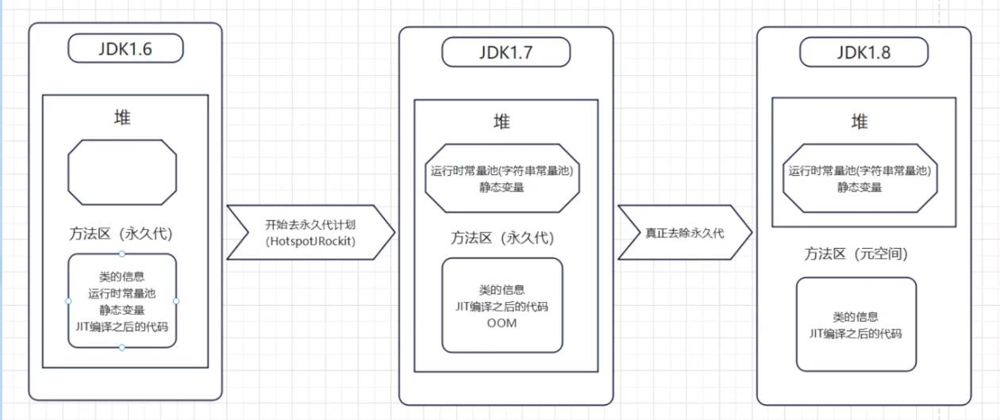

# 题目 01- 请你用自己的语言向我介绍 Java 运行时数据区（内存区域）  
题目简介：  
堆、虚拟机栈、本地方法栈、方法区（永久代、元空间）、运行时常量池（字符串常量池）、直接内存为什么堆内存要分年轻代和老年代？  

## 堆
如何划分空间和垃圾回收器直接相关

## 栈
栈帧：方法的出栈和入栈都是栈帧的出栈和入栈
当有新的方法被调用时会创建新的栈帧

### 本地方法栈
不是由Java编写的，Java提供原生方法的接口，*个人感觉类似nodejs里的插件，写C++*

## 方法区
存储JAVA语言编译后的代码
早期的实现叫永久代 后面的叫元空间
存储线程需要共享的数据
### 具体是存哪些东西
- class
- 运行时常量池
- JIT编译缓存编译信息
元空间只存class的信息，其他的信息都挪走了
  
### 运行时常量池
子节码常量池
- 一个class对象一个运行时常量池
字符串常量池  
写的字符串在编译期间会放入字符串常量池
- 全局所有的运行时常量池共享的区域
用hash表来存

# 题目 02- 描述一个 Java 对象的生命周期  
题目简介：  
- 解释一个对象的创建过程
- 解释一个对象的内存分配
- 解释一个对象的销毁过程
- 对象的 2 种访问方式是什么？
- 为什么需要内存担保？

## 创建对象
1. 遇到new指令（栈针）
2. 查看这个类是否被加载（如果没有就按加载类的顺序进行加载）
3. 分配内存空间 （堆内存）
4. 内存空间初始化零值
5. 必要的信息
   1. 对象的元数据
   2. 对象的hash值
   3. 对象头（锁）
### 内存的分配方式  
- 指针碰撞
  - 连续的内存
  - 多个线程同时进行操作时可能会有内存安全问题（本地线程内存缓存：单独分配一个给线程，乐观锁：分配内存时只有一个线程进行操作）
- 空间列表
  - 不连续的内存（标记整理算法进行清除）
### 分配内存的过程  
- 新对象申请
- 伊甸园区， 放的下就直接放了
- 放不下就运行一次youngGC
- 再看一下伊甸园区，放的下就放
- 如果还是放不下，就试图放到老年代
- 老年代，放的下就放
- 放不下就触发一次fullGC（放不下触发3次fullGC）
- 如果还放不下就OOM

## 内存担保  
当新生代无法分配内存的时候，试图将新生代的对象放到老年代当中去

## 对象的内存布局  
- 对象头信息  
- 实时数据区  
- 填充区域  

# 题目 03- 垃圾收集算法有哪些？垃圾收集器有哪些？他们的特点是什么？
题目简介：  
- ParNew 收集器
- ParallelScavenge 收集器
- ParallelOld 收集器
- CMS 收集器
- G1 收集器