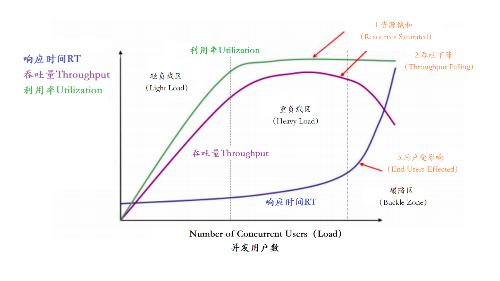
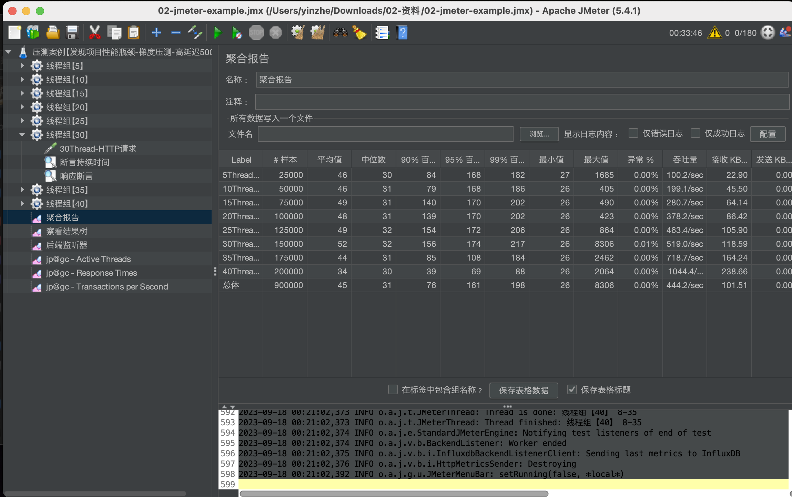
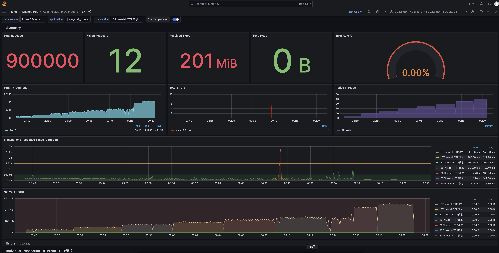
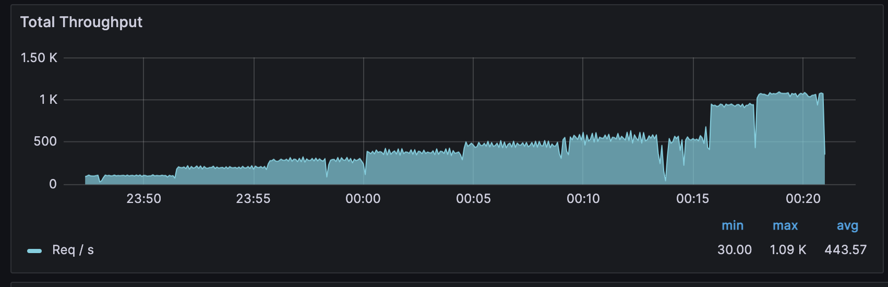
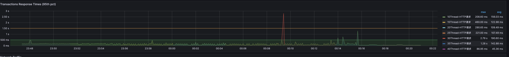
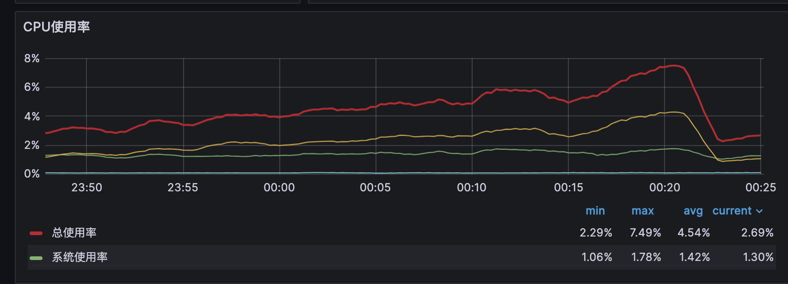
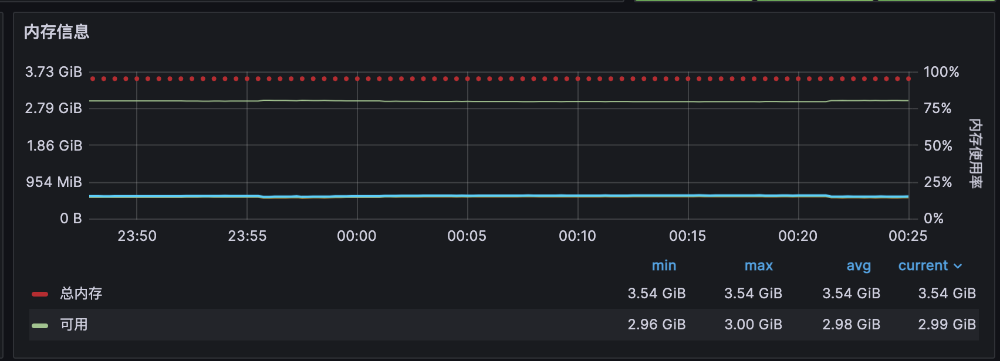
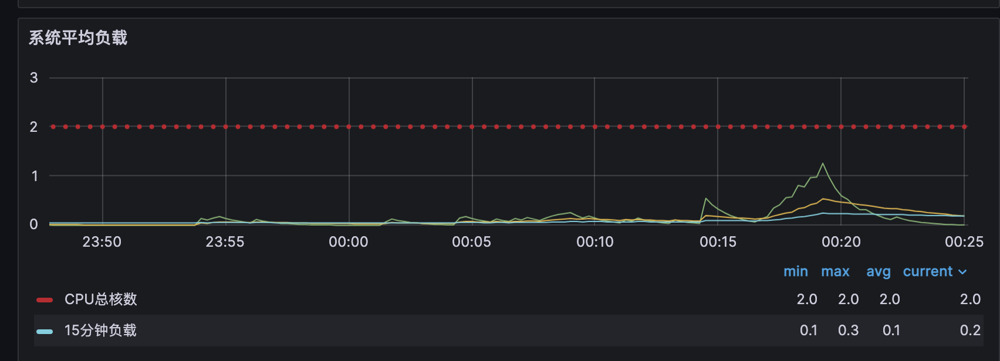
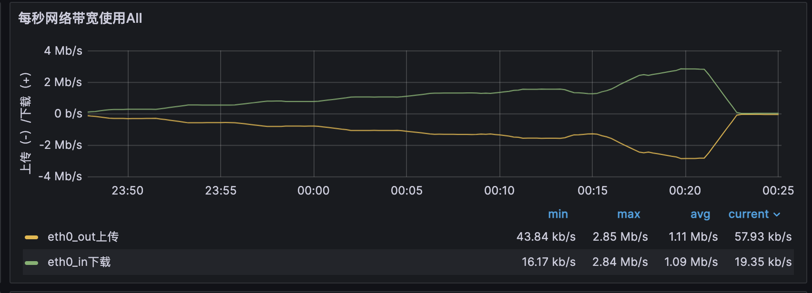

# 环境安装
对于FE来说是真头疼.

## prometheus
http://81.70.148.10:9090/targets
启动了两台
一台是Grafana-InfluxDB-Prometheus
一台是nodejs提供的API,用于压测的接口,**但是这个接口没有请求数据库~**  
### 展示  
- [集群dashboard](http://81.70.148.10:3000/d/9CWBz0bik/joge-linuxe99b86-e7bea4-zh?orgId=1&from=now-30m&to=now&var-origin_prometheus=&var-job=joge-Linux&var-hostname=All&var-instance=175.27.191.220:9100&var-device=All&var-interval=2m&var-maxmount=%2F&var-show_hostname=VM-16-12-centos&var-total=2)
- [jmeter dashboard](http://81.70.148.10:3000/d/f448b942-c3b7-4758-a8d8-c749003edc54/apache-jmeter-dashboard?orgId=1&from=now-1h&to=now&var-data_source=aeecf974-1dc0-47d0-bf6e-31ab04b7d54c&var-application=joge_mall_one&var-transaction=5Thread-HTTP%E8%AF%B7%E6%B1%82&var-measurement_name=jmeter&var-send_interval=5)

# 压测知识回顾
## 压测目的
- 找出系统瓶颈,初略统计系统上限
- 发现系统短板,针对性的优化
- ...

## 压测指标
- RT  
  系统对请求作出的响应时间
- 吞吐量  
  单位时间内处理请求的数量
- 并发用户数  
  并发数是指系统可以同时承载的正常使用系统的用户数量
- 错误率  
  失败请求占比
- 资源利用率  
  CPU、内存、网络、负载
  

### 系统负载  
system load是指系统CPU的繁忙程度即有多少进程等待被调度,**平均负载**是指一段时间内的平均负载,一般取一分钟吗,五分钟,十五分钟.
不同时间段的负载可以用来预判系统的即将处于什么状态.

# 性能瓶颈分析
http://175.27.191.220:9001/spu/goods/1  
http://175.27.191.220:9001/spu/goods/show/1  
以上两接口由nodejs提供,未请求数据库

## 测试指标
  
  
  
  
## 资源使用情况
  
  
  
  

## 结论
异步模型还是挺有优势的
- 会有偶尔的响应时间长(2.79秒)
- 带宽不够

继续补基础知识