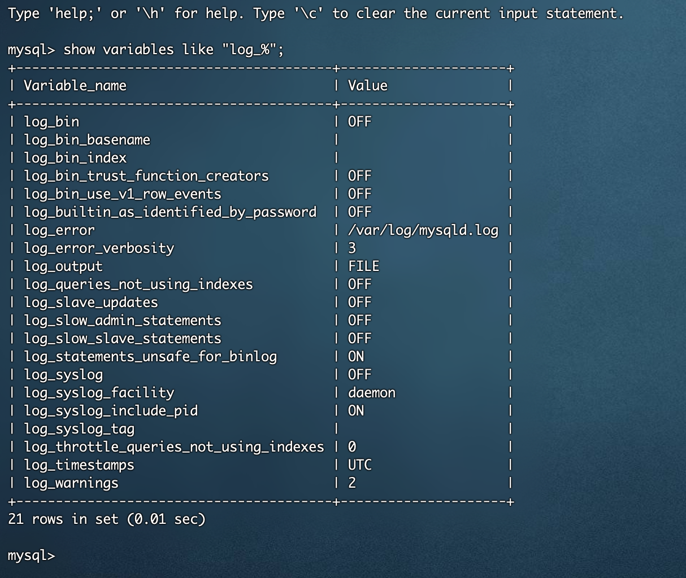
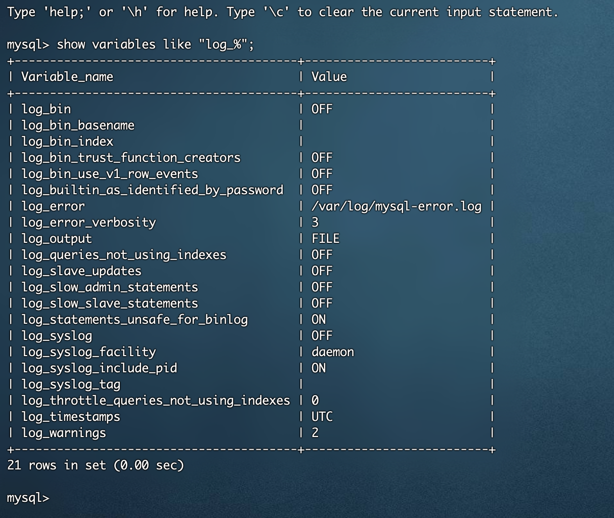
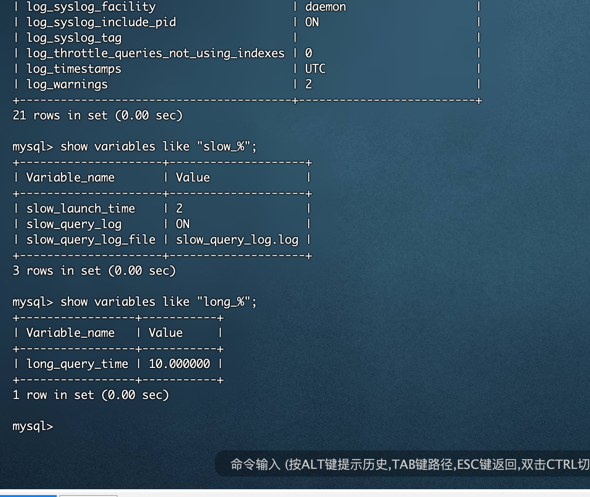

# 一条 SQL 语句在 MySQL 中是如何执行的？
- 连接到数据库
客户端与MySQL服务器建立连接，并选择要执行SQL语句的数据库。

- 词法分析和语法分析
MySQL解析SQL语句，将其分解为标记，并验证其语法结构。

- 优化器
优化器根据统计信息和查询规则生成多个可能的执行计划，并选择成本最低的计划。这包括表的访问顺序、连接方法等。

- 执行计划生成
生成最优执行计划，描述了如何从表中获取数据、如何执行连接等步骤。

- 存储引擎接口
执行计划被传递给存储引擎，MySQL服务器与存储引擎之间通过API进行通信。

- 数据的读取和处理
存储引擎按照执行计划从底层数据文件中读取数据，并进行过滤、排序等操作。

- 返回结果给MySQL服务器
存储引擎将处理好的结果返回给MySQL服务器。

- 返回结果给客户端
MySQL服务器将结果发送给客户端，完成SQL语句的执行。

# 事务是什么 

事务是数据库管理系统（DBMS）中的一个重要概念，用于管理对数据库的访问和操作，以确保数据的一致性、隔离性、持久性和原子性，通常用于处理复杂的数据库操作。

四个特性：

- 原子性（Atomicity）
原子性要求事务中的所有操作要么全部执行成功，要么全部失败回滚，不存在部分成功的情况。这确保了数据库的一致性，即使在事务执行过程中发生错误，也能够保持数据库的完整性。

- 一致性（Consistency）
一致性确保事务的执行将数据库从一个一致的状态转移到另一个一致的状态。在事务开始之前和结束之后，数据库必须满足一定的约束，以保持数据的合法性和完整性。

- 隔离性（Isolation）
隔离性指的是多个事务同时执行时，每个事务都应该被隔离，互不干扰。即使多个事务在同一时刻对相同的数据进行操作，也不应该相互影响。隔离性可以通过各种隔离级别（如读未提交、读提交、可重复读、串行化）来实现。

- 持久性（Durability）
持久性确保一旦事务被提交，其对数据库的影响将是永久性的，即使系统发生故障或重启，事务的结果也会被保留。

执行步骤：

- 开始事务
此时数据库记录事务开始的状态

- 执行操作
执行一系列数据库操作，可能包括插入、更新、删除等。

- 提交事务
如果所有操作都成功完成，事务被提交，将更改永久保存到数据库。

- 回滚事务
如果在事务执行期间发生错误或违反某些约束，事务将被回滚，所有操作都将撤销，数据库恢复到事务开始的状态。

# 简单的视频笔记
常用日志文件如下：
1. **错误日志：/var/log/mysql-error.log**
2. 二进制日志：/var/lib/mysql/mysql-bin
3. **查询日志：general_query.log**
4. **慢查询日志：slow_query_log.log**
5. 事务重做日志：redo log
6. 中继日志：relay log
7. undo log
8. ...

默认看不到查询日志和慢查询日志  
重做日志，和数据库高性能相关  

# 如何知道这些日志是否开启，及存储在哪？
`mysql> show variables like 'log_%';`
对数据库的配置都是通过属性写在数据库服务里的。  
  
1. 加个错误日志
``` shell
log_error=/var/log/mysql-error.log
log_warnings=2
```

``` shell
vim /etc/my.cnf
systemctl restart mysqld
```
  

## 通用查询日志  
不建议平时打开
## 慢查询日志  
纪录查询时间超长的查询  
``` shell
# 开启慢查询日志
slow_query_log=ON
# 慢查询的阈值，单位秒
long_query_time=10
# 日志记录文件
# 如果没有给出file_name值， 默认为主机名，后缀为-slow.log。
# 如果给出了文件名，但不是绝对路径名，文件则写入数据目录。
slow_query_log_file=slow_query_log.log
```

``` shell
show global status like '%Slow_queries%';
show variables like '%slow_query%';
show variables like 'long_query_time%';
```
  

## ibdata
系统表空间  

# 从一条SQL语句的完整流程
客户端  
连接器  
缓存  
分析器  
优化器  
执行器  
存储引擎  
文件

# 存储引擎